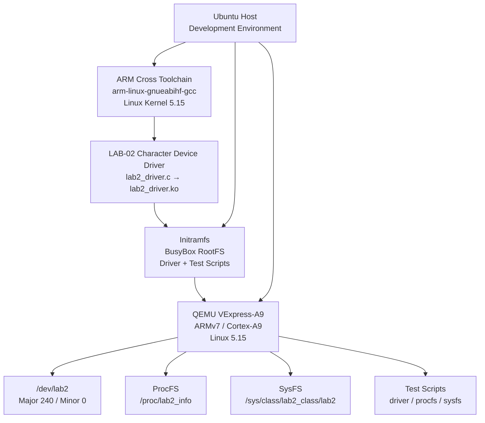
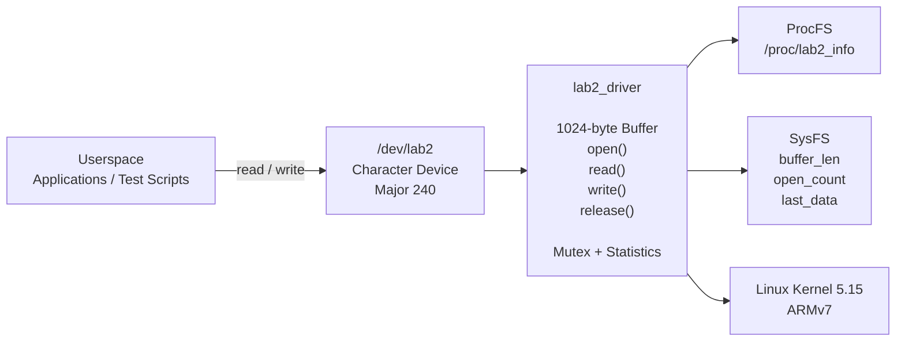
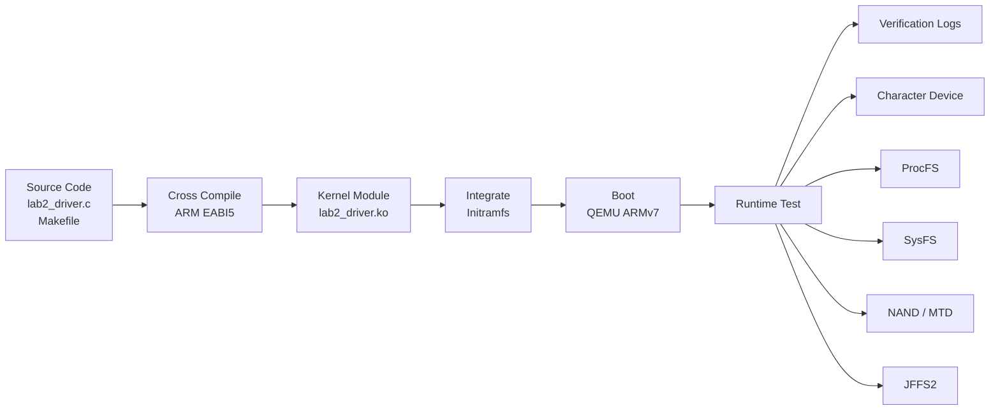
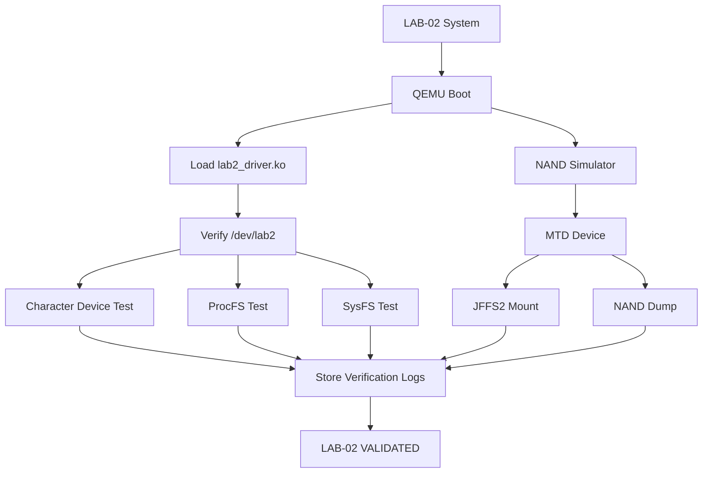

# Embedded Linux Lab 2

<p align="center">
  
  
  
  
  
  
</p>

<p align="center">
  <b>Embedded Linux Lab 2 — Character Device Driver, ProcFS, SysFS, Initramfs, MTD and JFFS2</b>
</p>

---

## 1. Overview

This project implements and validates a Linux character device driver on an ARMv7 Embedded Linux environment.

The project extends the Embedded Linux Lab 1 platform by introducing:

* A custom Linux character device driver
* `/dev/lab2` character device
* ProcFS interface
* SysFS attributes
* Kernel module integration into Initramfs
* Automatic driver loading during boot
* QEMU VExpress-A9 execution
* NAND simulator and MTD validation
* JFFS2 filesystem validation
* NAND raw data dump verification
* Runtime test logs and reproducibility evidence

The complete system is cross-compiled on Ubuntu and executed on an ARMv7 Cortex-A9 virtual platform using QEMU.

---

## 2. Lab Environment

| Component           | Configuration             |
| ------------------- | ------------------------- |
| Host OS             | Ubuntu 26.04 LTS 64-bit   |
| Target Architecture | ARMv7                     |
| CPU                 | ARM Cortex-A9             |
| Kernel              | Linux 5.15                |
| Machine             | QEMU VExpress-A9          |
| RAM                 | 512 MB                    |
| SMP                 | 2 CPUs                    |
| Cross Compiler      | `arm-linux-gnueabihf-gcc` |
| Root Filesystem     | BusyBox Initramfs         |
| Character Device    | `/dev/lab2`               |
| Major Number        | 240                       |
| Buffer Size         | 1024 bytes                |
| Filesystem          | JFFS2                     |
| Flash Interface     | MTD / NAND Simulator      |

---

## 3. Project Objectives

The main objectives of this laboratory are:

1. Implement a Linux character device driver.
2. Register and create `/dev/lab2`.
3. Implement `open()`, `read()`, `write()` and `release()`.
4. Maintain driver runtime statistics.
5. Protect shared driver state using a mutex.
6. Expose driver information through ProcFS.
7. Expose runtime attributes through SysFS.
8. Integrate the driver into the Initramfs root filesystem.
9. Automatically load the driver during system boot.
10. Execute and validate the driver inside QEMU.
11. Simulate NAND flash using `nandsim`.
12. Access the simulated flash through the MTD subsystem.
13. Mount and validate a JFFS2 filesystem.
14. Perform a raw NAND dump and verify NAND/OOB information.
15. Preserve reproducible logs for all major validation stages.

---

## 4. Repository Structure

```text
embedded-linux-lab2/
├── driver/
│   ├── lab2_driver.c
│   ├── Makefile
│   └── lab2_driver.ko
│
├── rootfs/
│   └── initramfs/
│       ├── etc/
│       │   ├── inittab
│       │   └── init.d/
│       │       └── rcS
│       │
│       ├── lib/
│       │   └── modules/
│       │       └── 5.15.0/
│       │           └── lab2_driver.ko
│       │
│       └── usr/
│           ├── bin/
│           │   ├── test_driver.sh
│           │   └── test_procfs.sh
│           │
│           └── etc/
│               ├── inittab
│               └── init.d/
│                   └── rcS
│
├── output/
│   └── initramfs_lab2.cpio.gz
│
├── logs/
│   ├── boot_log.txt
│   ├── driver_test.txt
│   ├── procfs_test.txt
│   └── mtd_jffs2.txt
│
│
├── .gitignore
└── README.md
```

---

## 5. System Architecture



---

## 6. Driver Architecture

The LAB-02 driver provides a character-device interface between userspace applications and kernel-space driver logic.



---

## 7. Character Device Driver

The driver registers the following character device:

```text
Device name  : lab2
Major number : 240
Minor number : 0
Buffer size  : 1024 bytes
Device node  : /dev/lab2
```

The driver implements:

```text
open()
read()
write()
release()
```

The internal driver state contains:

```text
buffer
buffer_len
open_count
last_data
```

A mutex is used to protect shared driver state during concurrent access.

---

## 8. ProcFS Interface

The driver creates:

```text
/proc/lab2_info
```

The ProcFS interface provides runtime information including:

```text
Driver name
Major number
Buffer size
Data length
Open count
Last data
```

Example:

```text
LAB-02 Driver Statistics
======================
Driver name   : lab2
Major number  : 240
Buffer size   : 1024 bytes
Data length   : 10 bytes
Open count    : 8
Last data     : [Message_3]
```

---

## 9. SysFS Interface

The driver creates a SysFS class and device:

```text
/sys/class/lab2_class/lab2/
```

The following attributes are provided:

```text
buffer_len
open_count
last_data
```

Example:

```text
buffer_len=10
open_count=8
last_data=Message_3
```

---

## 10. Driver Build

The driver is cross-compiled against the Linux 5.15 kernel.

The Makefile uses:

```make
KDIR := $(HOME)/embedded_lab1/kernel/linux-5.15
ARCH := arm
CROSS_COMPILE := arm-linux-gnueabihf-
obj-m += lab2_driver.o
```

Build command:

```bash
cd ~/embedded_lab2/driver

make -C ~/embedded_lab1/kernel/linux-5.15 \
    ARCH=arm \
    CROSS_COMPILE=arm-linux-gnueabihf- \
    M=$PWD \
    modules
```

The generated module is:

```text
driver/lab2_driver.ko
```

The final module is an ARM EABI5 kernel module built for Linux 5.15.

---

## 11. Initramfs Integration

The kernel module is integrated into:

```text
rootfs/initramfs/lib/modules/5.15.0/lab2_driver.ko
```

The final Initramfs image is:

```text
output/initramfs_lab2.cpio.gz
```

The Initramfs contains:

```text
/etc/inittab
/etc/init.d/rcS
/lib/modules/5.15.0/lab2_driver.ko
/usr/bin/test_driver.sh
/usr/bin/test_procfs.sh
```

The startup script automatically loads the driver and creates the device node.

---

## 12. Boot Workflow



---

## 13. QEMU ARMv7 Environment

The target system is executed using:

```bash
qemu-system-arm \
  -M vexpress-a9 \
  -cpu cortex-a9 \
  -m 512M \
  -smp 2 \
  -nographic \
  -kernel ~/embedded_lab1/output/zImage \
  -dtb ~/embedded_lab1/output/vexpress-v2p-ca9.dtb \
  -initrd ~/embedded_lab2/output/initramfs_lab2.cpio.gz \
  -append 'console=ttyAMA0,115200 rdinit=/sbin/init mem=512M'
```

Target architecture:

```text
ARMv7
Cortex-A9
VExpress-A9
Linux 5.15
512 MB RAM
2 CPUs
```

---

## 14. Device Node Verification

After boot, the driver creates:

```text
/dev/lab2
```

Expected device information:

```text
crw-rw-rw- 1 root 0 240,0 /dev/lab2
```

The major/minor numbers are:

```text
Major = 240
Minor = 0
```

The driver can also create the device node manually:

```bash
mknod /dev/lab2 c 240 0
```

---

## 15. Character Device Functional Test

The driver test script performs:

1. Module loading
2. Module verification
3. Device node verification
4. Write operation
5. Read operation
6. Multiple write/read operations
7. Kernel message verification

Test command:

```bash
/usr/bin/test_driver.sh
```

The test successfully validates:

```text
Hello from userspace, LAB-02!

Message_1
Message_2
Message_3
```

Final driver statistics:

```text
LAB-02 Driver Statistics
======================
Driver name   : lab2
Major number  : 240
Buffer size   : 1024 bytes
Data length   : 10 bytes
Open count    : 8
Last data     : [Message_3]
```

Final SysFS state:

```text
buffer_len=10
open_count=8
last_data=Message_3
```

Result:

```text
=== Test PASSED ===
```

---

## 16. ProcFS and SysFS Validation

The ProcFS and SysFS test verifies that driver state is correctly exposed to userspace.

Test command:

```bash
/usr/bin/test_procfs.sh
```

The test performs:

```text
1. Load driver
2. Read /proc/lab2_info
3. Write test data to /dev/lab2
4. Read /proc/lab2_info again
5. Read SysFS attributes
```

Test data:

```text
Embedded Linux Lab2 Test Data
```

Expected result:

```text
Data length   : 30 bytes
Open count    : 1
Last data     : [Embedded Linux Lab2 Test Data]
```

SysFS:

```text
buffer_len : 30
open_count : 1
last_data  : Embedded Linux Lab2 Test Data
```

Result:

```text
=== procfs/sysfs Test PASSED ===
```

---

## 17. NAND Simulator and MTD

The host-side NAND simulation uses the Linux NAND simulator:

```bash
sudo modprobe nandsim first_id_byte=0x20 second_id_byte=0x35
```

The MTD subsystem reports:

```text
dev:    size   erasesize  name
mtd0: 02000000 00001000 "BIOS"
mtd1: 02000000 00004000 "NAND simulator partition 0"
```

The simulated NAND device is exposed as:

```text
/dev/mtd1
/dev/mtd1ro
```

The block device used for filesystem testing is:

```text
/dev/mtdblock1
```

---

## 18. JFFS2 Filesystem Test

The simulated NAND partition is mounted using JFFS2:

```bash
sudo mount -t jffs2 /dev/mtdblock1 /mnt/jffs2
```

Mounted filesystem:

```text
/dev/mtdblock1 on /mnt/jffs2 type jffs2 (rw,relatime)
```

The filesystem contains:

```text
hello.txt
info.txt
boot.log
```

File contents:

```text
hello.txt
-----------
Hello from JFFS2!
```

```text
info.txt
-----------
Embedded Linux Lab2
```

```text
boot.log
-----------
Mon Oct  5 09:56:42 AM +07 2026
```

Result:

```text
=== JFFS2 TEST PASSED ===
```

---

## 19. NAND Dump Verification

A raw NAND dump was performed using:

```bash
sudo nanddump -o -l 512 /dev/mtd1
```

The NAND simulator reported:

```text
ECC failed: 0
ECC corrected: 0
Number of bad blocks: 0
Number of bbt blocks: 0

Block size 16384
Page size 512
OOB size 16
```

The dump contains:

```text
512 bytes NAND data
+
16 bytes OOB data
=
528 bytes
```

Dump file:

```text
/tmp/dump.bin
```

Verified size:

```text
-rw-r--r-- 1 root root 528 /tmp/dump.bin
```

---

## 20. Verification Flow



---

## 21. Test Evidence

The repository stores the main validation evidence under:

```text
logs/
├── boot_log.txt
├── driver_test.txt
├── procfs_test.txt
└── mtd_jffs2.txt
```

### Boot Log

```text
logs/boot_log.txt
```

Contains the complete QEMU boot and runtime verification session.

### Character Device Test

```text
logs/driver_test.txt
```

Contains:

```text
Module loading
Device node verification
Write/read tests
Multiple write/read tests
dmesg verification
ProcFS verification
SysFS verification
```

Final result:

```text
=== Test PASSED ===
```

### ProcFS / SysFS Test

```text
logs/procfs_test.txt
```

Contains the validation of:

```text
/proc/lab2_info

/sys/class/lab2_class/lab2/
```

Final result:

```text
=== procfs/sysfs Test PASSED ===
```

### MTD / JFFS2 Test

```text
logs/mtd_jffs2.txt
```

Contains:

```text
NAND simulator information
MTD device information
JFFS2 mount
JFFS2 file contents
NAND dump information
ECC verification
Bad-block verification
```

Final result:

```text
=== JFFS2 TEST PASSED ===
```

---

## 22. Verification Summary

| Component                      | Status |
| ------------------------------ | ------ |
| ARMv7 target                   | PASS   |
| Linux 5.15                     | PASS   |
| QEMU VExpress-A9               | PASS   |
| Character device driver        | PASS   |
| `/dev/lab2`                    | PASS   |
| Major 240 / Minor 0            | PASS   |
| Read / Write operations        | PASS   |
| Multiple read/write operations | PASS   |
| Mutex-protected driver state   | PASS   |
| ProcFS                         | PASS   |
| SysFS                          | PASS   |
| Initramfs integration          | PASS   |
| Automatic module loading       | PASS   |
| NAND simulator                 | PASS   |
| MTD                            | PASS   |
| JFFS2                          | PASS   |
| NAND dump                      | PASS   |
| ECC errors                     | 0      |
| Bad blocks                     | 0      |

---

## 23. Repository Hygiene

Build-generated kernel module artifacts are excluded using `.gitignore`.

Examples:

```text
*.o
*.mod
*.mod.c
*.mod.o
Module.symvers
.*.cmd
```

The final deliverables are intentionally preserved:

```text
driver/lab2_driver.ko
rootfs/initramfs/lib/modules/5.15.0/lab2_driver.ko
output/initramfs_lab2.cpio.gz
logs/*.txt
```

This keeps the repository focused on source code, final binaries, reproducible rootfs content and verification evidence.

---

## 24. Reproducibility Flow

The project can be reproduced using the following high-level workflow:

```text
Linux Kernel 5.15
        │
        ▼
ARM Cross Compilation
        │
        ▼
Build lab2_driver.ko
        │
        ▼
Copy Driver into Initramfs
        │
        ▼
Create initramfs_lab2.cpio.gz
        │
        ▼
Boot QEMU VExpress-A9
        │
        ▼
Load Driver
        │
        ├── /dev/lab2
        ├── /proc/lab2_info
        └── /sys/class/lab2_class/lab2/
        │
        ▼
Run Driver Tests
        │
        ▼
NAND Simulator
        │
        ▼
MTD
        │
        ▼
JFFS2
        │
        ▼
NAND Dump
        │
        ▼
Verification Logs
```

---

## 25. Final Result

The Embedded Linux Lab 2 implementation successfully demonstrates a complete Embedded Linux driver workflow from kernel-module development to runtime validation.

The final system provides:

```text
ARMv7 Embedded Linux
        │
        ├── Linux 5.15
        ├── QEMU VExpress-A9
        ├── BusyBox Initramfs
        ├── LAB-02 Character Device
        ├── /dev/lab2
        ├── ProcFS
        ├── SysFS
        ├── NAND Simulator
        ├── MTD
        ├── JFFS2
        └── NAND Dump Verification
```

All major components were built, booted and validated successfully.

```text
╔══════════════════════════════════════════════╗
║          EMBEDDED LINUX LAB 2               ║
║                                              ║
║   Character Driver       : PASS              ║
║   ProcFS / SysFS         : PASS              ║
║   Initramfs              : PASS              ║
║   QEMU ARMv7             : PASS              ║
║   NAND / MTD             : PASS              ║
║   JFFS2                  : PASS              ║
║   NAND Dump              : PASS              ║
║                                              ║
║             STATUS: COMPLETED               ║
╚══════════════════════════════════════════════╝
```

---

## Author

**Hoang Trung Hai**

**FPT University — IC Design**

Embedded Linux Lab 2
