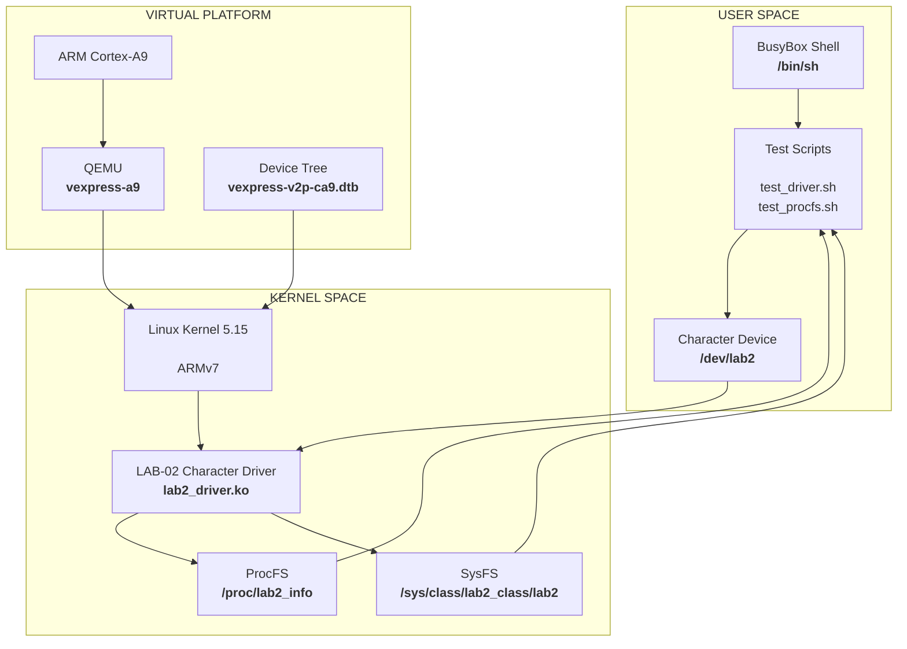
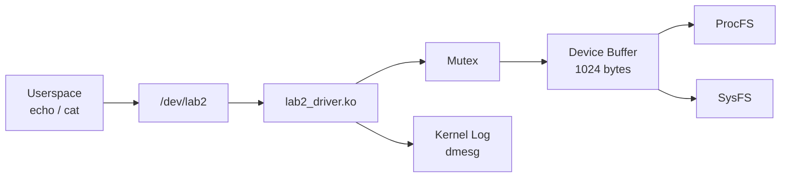
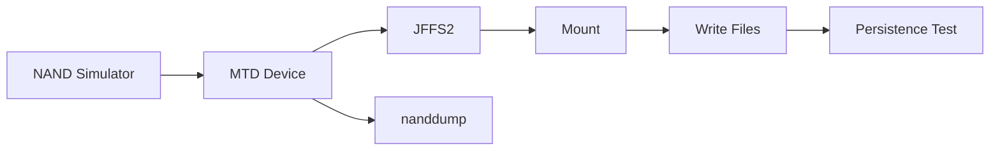
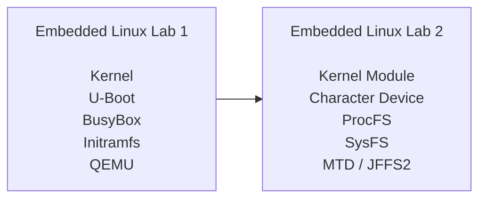

# Embedded Linux Lab 2

<p align="center">
  
  
  
  
  
  
</p>

<p align="center">
  <b>Linux Kernel Driver Development on an ARMv7 Embedded Linux Platform.</b>
</p>

<p align="center">
  Character Device · Kernel Module · ProcFS · SysFS · BusyBox · Initramfs · QEMU · MTD · NAND · JFFS2
</p>

---

## Overview

This repository contains the implementation of **Embedded Linux Lab 2**, focusing on Linux kernel module development and low-level device interfaces in an ARMv7 Embedded Linux environment.

The project extends the minimal Linux system developed in Lab 1 by introducing a custom **character device driver**, runtime driver interfaces through **ProcFS and SysFS**, and an experimental **MTD/NAND/JFFS2 storage environment**.

The driver is cross-compiled for ARMv7, integrated into a BusyBox-based initramfs, and executed on the QEMU `vexpress-a9` virtual platform.

The complete workflow is:

```text
Linux Kernel 5.15
        +
ARMv7 Cross Compilation
        +
LAB-02 Kernel Module
        +
BusyBox Initramfs
        ↓
QEMU ARM Cortex-A9
        ↓
Character Device
/dev/lab2
        ↓
ProcFS + SysFS
        ↓
Runtime Driver Verification
```

The laboratory also explores:

```text
NAND Simulator
      ↓
MTD Subsystem
      ↓
JFFS2 Filesystem
      ↓
Mount / Write / Persistence
      ↓
NAND Dump Verification
```

---

## Architecture

The project follows a Linux kernel driver architecture in which userspace interacts with the custom kernel module through multiple kernel interfaces.



---

## Driver Data Flow

The character device uses an in-kernel buffer protected by a mutex.



The same internal driver state can therefore be inspected through:

```text
/dev/lab2
/proc/lab2_info
/sys/class/lab2_class/lab2/*
dmesg
```

---

## Project Goals

The laboratory focuses on the following objectives:

* Develop a Linux character device driver.
* Build an ARMv7 kernel module using cross-compilation.
* Register a character device with a static major number.
* Implement `open`, `read`, `write`, and `release`.
* Protect shared driver state using a kernel mutex.
* Create a `/dev/lab2` device node.
* Expose driver statistics through ProcFS.
* Expose runtime attributes through SysFS.
* Integrate the kernel module into an initramfs.
* Boot and test the driver on QEMU ARM Cortex-A9.
* Use kernel logging for driver debugging and verification.
* Experiment with Linux MTD and NAND simulation.
* Create and test a JFFS2 filesystem.
* Verify NAND data using `nanddump`.
* Maintain the project using milestone-based Git development.

---

## Technology Stack

| Component       | Version / Configuration       |
| :-------------- | :---------------------------- |
| Architecture    | ARMv7                         |
| CPU             | ARM Cortex-A9                 |
| Emulator        | QEMU `vexpress-a9`            |
| Kernel          | Linux 5.15                    |
| Kernel Module   | `lab2_driver.ko`              |
| Device          | `/dev/lab2`                   |
| Major Number    | `240`                         |
| Minor Number    | `0`                           |
| Buffer Size     | `1024 bytes`                  |
| ProcFS          | `/proc/lab2_info`             |
| SysFS           | `/sys/class/lab2_class/lab2/` |
| Userspace       | BusyBox                       |
| Root Filesystem | Initramfs                     |
| Storage         | Linux MTD / NAND simulator    |
| Filesystem      | JFFS2                         |
| Cross Compiler  | `arm-linux-gnueabihf-`        |
| Console         | `ttyAMA0`                     |
| Memory          | `512 MB`                      |
| SMP             | `2 CPUs`                      |
| Host OS         | Ubuntu Linux                  |

---

## Repository Structure

```text
embedded-linux-lab2/
│
├── driver/
│   ├── Makefile
│   └── lab2_driver.c
│
├── rootfs/
│   └── initramfs/
│       ├── bin/
│       ├── dev/
│       ├── etc/
│       ├── init
│       ├── lib/
│       │   └── modules/
│       │       └── 5.15.0/
│       │           └── lab2_driver.ko
│       ├── proc/
│       ├── root/
│       ├── sbin/
│       ├── sys/
│       ├── tmp/
│       └── usr/
│           ├── bin/
│           │   ├── test_driver.sh
│           │   └── test_procfs.sh
│           └── sbin/
│               ├── nanddump
│               └── nandwrite
│
├── mtd/
│
├── configs/
│
├── output/
│
├── .gitignore
└── README.md
```

Generated kernel-module metadata, temporary MTD data, QEMU runtime files, and compressed build outputs are excluded from version control where appropriate.

---

# 1. LAB-02 Character Device Driver

The core component is:

```text
driver/lab2_driver.c
```

The driver registers a Linux character device with:

```text
Device name : lab2
Major       : 240
Minor       : 0
Buffer      : 1024 bytes
```

The corresponding userspace device is:

```text
/dev/lab2
```

### Supported Operations

The driver implements the standard character-device callbacks:

```text
open()
read()
write()
release()
```

The driver maintains an internal buffer and runtime statistics.

### Driver State

```text
Device buffer
Buffer length
Open count
Last written data
```

Access to shared state is protected using a kernel mutex.

---

# 2. Kernel Module

The driver is built as an external Linux kernel module:

```text
lab2_driver.ko
```

The module is cross-compiled for ARM using:

```text
arm-linux-gnueabihf-
```

### Makefile

```make
KDIR := $(HOME)/embedded_lab1/kernel/linux-5.15
ARCH := arm
CROSS_COMPILE := arm-linux-gnueabihf-

obj-m += lab2_driver.o
```

### Build

```bash
cd ~/embedded_lab2/driver

make ARCH=arm \
     CROSS_COMPILE=arm-linux-gnueabihf- \
     -C ~/embedded_lab1/kernel/linux-5.15 \
     M=$PWD \
     modules
```

Verify the module:

```bash
file lab2_driver.ko
```

Expected architecture:

```text
ARM
EABI5
```

The build-generated module remains outside the tracked `driver/` source tree, while the tested module integrated into the initramfs is retained as part of the runtime environment.

---

# 3. Device Node

The driver uses major number `240`.

The device node is:

```text
/dev/lab2
```

Create manually when required:

```bash
mknod /dev/lab2 c 240 0
chmod 666 /dev/lab2
```

Verify:

```bash
ls -l /dev/lab2
```

Expected:

```text
crw-rw-rw-  1 root  0  240, 0  /dev/lab2
```

---

# 4. ProcFS Interface

The driver exposes runtime statistics through:

```text
/proc/lab2_info
```

The interface is implemented using the Linux ProcFS and sequence-file infrastructure.

### Example

```bash
cat /proc/lab2_info
```

Initial state:

```text
LAB-02 Driver Statistics
======================
Driver name   : lab2
Student name  : ...
Student ID    : ...
Major number  : 240
Buffer size   : 1024 bytes
Data length   : 0 bytes
Open count    : 0
```

After writing test data:

```text
Data length   : 30 bytes
Open count    : 1
Last data     : [Embedded Linux Lab2 Test Data
]
```

ProcFS therefore provides a read-only diagnostic interface for the driver.

---

# 5. SysFS Interface

The driver creates the class:

```text
/sys/class/lab2_class/lab2/
```

The runtime attributes include:

```text
buffer_len
open_count
last_data
student_name
student_id
```

### Verification

```bash
SYSFS=/sys/class/lab2_class/lab2

cat $SYSFS/buffer_len
cat $SYSFS/open_count
cat $SYSFS/last_data
```

Observed test result:

```text
buffer_len : 30
open_count : 1
last_data  : Embedded Linux Lab2 Test Data
```

This provides direct visibility into the driver's internal state through the Linux device model.

---

# 6. Initramfs Integration

The compiled module is integrated into the BusyBox initramfs:

```text
/lib/modules/5.15.0/lab2_driver.ko
```

During system initialization, the startup script loads the module and prepares the device node.


This allows the driver to be available immediately after userspace initialization.

---

# 7. QEMU ARM Platform

The complete driver environment is tested using QEMU.

### Platform

```text
Machine : vexpress-a9
CPU     : Cortex-A9
ISA     : ARMv7
Memory  : 512 MB
SMP     : 2 CPUs
Console : ttyAMA0
```

### Boot Command

```bash
qemu-system-arm \
  -M vexpress-a9 \
  -cpu cortex-a9 \
  -m 512M \
  -smp 2 \
  -nographic \
  -kernel ~/embedded_lab1/output/zImage \
  -dtb ~/embedded_lab1/output/vexpress-v2p-ca9.dtb \
  -initrd ~/embedded_lab2/output/initramfs_lab2.cpio.gz \
  -append 'console=ttyAMA0,115200 rdinit=/sbin/init mem=512M'
```

The kernel and Device Tree are reused from the Lab 1 ARMv7 environment.

---

# 8. Driver Verification

After booting QEMU:

```bash
lsmod | grep lab2
```

Expected:

```text
lab2_driver  16384  0  - Live 0x7f000000 (O)
```

Verify the device:

```bash
ls -l /dev/lab2
```

Expected:

```text
crw-rw-rw-    1 root     0         240,   0 /dev/lab2
```

Verify the ProcFS interface:

```bash
cat /proc/lab2_info
```

Verify the SysFS interface:

```bash
find /sys/class/lab2_class/lab2 -maxdepth 1 -type f
```

---

# 9. Functional Test

The integrated test script is:

```text
/usr/bin/test_procfs.sh
```

Execute:

```bash
/usr/bin/test_procfs.sh
```

The test performs:

```text
1. Load the LAB-02 module
2. Prepare /dev/lab2
3. Read initial ProcFS statistics
4. Write test data to /dev/lab2
5. Read updated ProcFS statistics
6. Inspect SysFS attributes
7. Report the final test status
```

Test data:

```text
Embedded Linux Lab2 Test Data
```

Observed result:

```text
buffer_len : 30
open_count : 1
last_data  : Embedded Linux Lab2 Test Data

=== procfs/sysfs Test PASSED ===
```

---

# 10. Kernel Log Verification

Driver activity can be monitored through the kernel ring buffer:

```bash
dmesg | grep lab2
```

Observed messages include:

```text
lab2_driver: initializing module
lab2_driver: loaded, major=240
lab2_driver: /proc/lab2_info created
lab2_driver: device opened
lab2_driver: received 30 bytes
lab2_driver: device closed
```

This confirms the complete path:

```text
Userspace
   ↓
/dev/lab2
   ↓
Character Driver
   ↓
Kernel Buffer
   ↓
Driver Statistics
   ↓
ProcFS / SysFS
```

---

# 11. MTD and NAND Simulator

The second part of the laboratory explores Linux's Memory Technology Device subsystem using the NAND simulator.

The host-side workflow is:



The NAND simulator was configured on the host Linux system.

Example module configuration:

```bash
modprobe nandsim \
    first_id_byte=0x20 \
    second_id_byte=0x35
```

---

# 12. MTD Layout

The observed host MTD layout was:

```text
mtd0  32 MiB   BIOS
mtd1  128 MiB  NAND simulator partition 0
```

The JFFS2 experiment used the NAND simulator partition exposed as:

```text
/dev/mtdblock1
```

The exact MTD device number is environment-dependent because existing MTD devices can change the numbering.

Inspect the current layout with:

```bash
cat /proc/mtd
```

---

# 13. JFFS2 Filesystem

The JFFS2 experiment covers:

```text
Filesystem creation
NAND programming
Mounting
File creation
File reading
Persistence verification
Raw NAND dumping
```

The filesystem was mounted at:

```text
/mnt/jffs2
```

Example files:

```text
hello.txt
info.txt
boot.log
```

Example contents:

```text
hello.txt
Hello from JFFS2!
```

```text
info.txt
Embedded Linux Lab2
```

JFFS2 is particularly suitable for raw flash devices because it is designed around erase blocks, wear considerations, and flash-specific behavior.

---

# 14. NAND Dump Verification

Raw NAND data was dumped using:

```bash
nanddump
```

The resulting temporary dump was:

```text
/tmp/dump.bin
```

Observed NAND characteristics:

| Parameter    | Value       |
| :----------- | :---------- |
| Erase Block  | 16384 bytes |
| Page Size    | 512 bytes   |
| OOB Size     | 16 bytes    |
| ECC Failures | 0           |
| Bad Blocks   | 0           |

The dump can be inspected with:

```bash
hexdump -C /tmp/dump.bin | head
```

Temporary NAND dumps and generated filesystem images are excluded from Git.

---

# 15. Verification Summary

| Component                | Result |
| :----------------------- | :----- |
| ARMv7 cross-compilation  | PASS   |
| Kernel module build      | PASS   |
| `lab2_driver.ko`         | PASS   |
| Module loading           | PASS   |
| Character device         | PASS   |
| `/dev/lab2`              | PASS   |
| Major number `240`       | PASS   |
| ProcFS                   | PASS   |
| SysFS                    | PASS   |
| Character-device write   | PASS   |
| Driver statistics        | PASS   |
| Kernel logging           | PASS   |
| QEMU ARMv7 boot          | PASS   |
| BusyBox initramfs        | PASS   |
| NAND simulator           | PASS   |
| JFFS2                    | PASS   |
| NAND write               | PASS   |
| Persistence verification | PASS   |
| NAND dump                | PASS   |
| ECC failures             | `0`    |
| Bad blocks               | `0`    |

---

# 16. Git Development

The repository uses milestone-based Git development to keep the project history clean and traceable.


### Milestone 1

```text
8afb6b2
Milestone 1: Implement LAB-02 character device driver
```

Initial LAB-02 driver implementation, build configuration, root filesystem integration, and supporting userspace environment.

### Milestone 2

```text
d464358
Milestone 2: Verify ProcFS and SysFS interfaces
```

Driver correction and verification of ProcFS, SysFS, character-device functionality, and QEMU runtime behavior.

The repository intentionally keeps these as the two primary development milestones rather than creating artificial commits for work that was not separately versioned.

---

# 17. Build Environment

### Host Operating System

```text
Ubuntu 26.04 LTS
64-bit
```

### Cross Compiler

```bash
arm-linux-gnueabihf-gcc --version
```

### QEMU

```bash
qemu-system-arm --version
```

### Kernel

```text
Linux 5.15.0
```

### Architecture

```text
ARMv7 / ARM EABI
```

### Main Development Tools

```text
gcc
make
binutils
qemu-system-arm
busybox
cpio
mtd-utils
```

---

# 18. Repository Hygiene

The repository uses `.gitignore` to keep generated and temporary files outside version control.

Ignored content includes:

```text
Kernel module build artifacts
Module.symvers
modules.order
*.o
*.mod.c
*.mod.o
QEMU runtime files
Compressed temporary outputs
MTD images
NAND dump files
Temporary logs
```

The tested module integrated into the initramfs is intentionally retained:

```text
rootfs/initramfs/lib/modules/5.15.0/lab2_driver.ko
```

This allows the repository to preserve the exact module used by the tested runtime environment.

---

# 19. Learning Outcomes

This laboratory provides practical experience with:

```text
Linux Kernel Modules
        │
        ├── Character Devices
        ├── Device Nodes
        ├── File Operations
        ├── Kernel Mutex
        ├── ProcFS
        ├── SysFS
        ├── Kernel Logging
        ├── Initramfs
        ├── BusyBox
        ├── QEMU ARM Emulation
        ├── MTD
        ├── NAND Simulation
        └── JFFS2
```

The project demonstrates how a userspace application can interact with a custom Linux kernel driver and how kernel state can be exposed through standard Linux virtual filesystems.

---

# 20. Lab 1 → Lab 2

Lab 2 builds directly on the embedded Linux environment established in Lab 1.



### Lab 1

```text
Boot the Embedded Linux System
```

### Lab 2

```text
Develop and interact with the Linux Kernel
```

Together, the two laboratories form a progression from building an Embedded Linux platform to developing software directly inside the Linux kernel.

---

## Author

<p align="center">
  <b>Hoang Trung Hai</b><br>
  IC Design Student · FPT University
</p>

<p align="center">
  <a href="https://github.com/BlackWater006">
    
  </a>
</p>

---

## License

This repository is an academic Embedded Linux laboratory project created for educational purposes.

The project integrates and interacts with open-source software including the Linux Kernel, BusyBox, QEMU, and MTD utilities. Each third-party component remains subject to its respective license.

See the repository license file for the applicable project terms.

---

<p align="center">
  <b>Embedded Linux Lab 2</b><br>
  ARMv7 · Linux Kernel 5.15 · QEMU · Character Driver · ProcFS · SysFS · MTD · JFFS2
</p>
